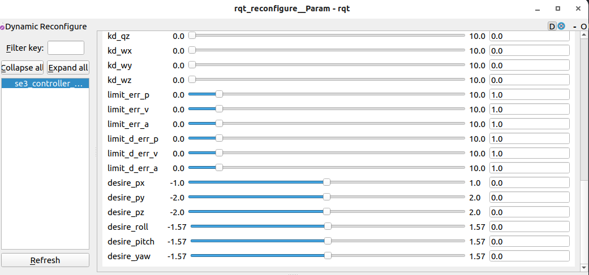
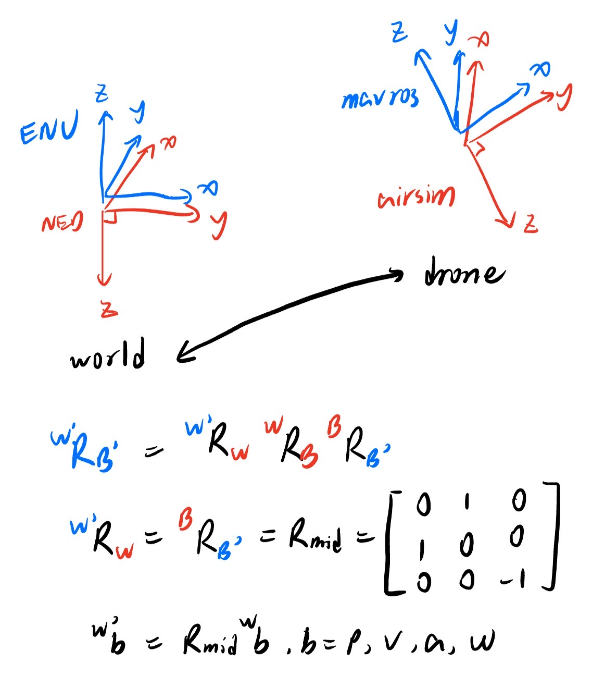

# SE(3) Controller for Quadrotor

## 1 Usage

**Make sure that p, v, a, j are in the world coordinate!!!**

### 1.1 PX4

**Important!!!: cancel the comment "#define VEL_IN_BODY" and comment "#define AIRSIM" at the beginning of se3_controller/include/se3_controller/se3_controller.hpp**

```
sudo apt install ros-noetic-ddynamic-reconfigure
cd catkin_ws/src
git clone https://github.com/HITSZ-MAS/se3_controller.git
cd ..
catkin_make -DCMAKE_BUILD_TYPE=Release -DCMAKE_EXPORT_COMPILE_COMMANDS=Yes
source ./devel/setup.zsh
roslaunch px4 mavros_posix_sitl.launch
roslaunch se3_controller px4_example.launch
```

dynamic tune param & set desire p and euler angle



see se3_example.cpp for more details. 


real world exp


### 1.2 AirSim (for RM competition)

**Important!!!: cancel the comment "#define AIRSIM" and comment "#define VEL_IN_BODY" at the beginning of se3_controller/include/se3_controller/se3_controller.hpp**

```
// open airsim simulate env
cd ${your folder}/simulator_LINUX
python launcher.py
cd ${your folder}/roswrapper/ros
catkin build

gedit ~/.zshrc
source ${your folder}/roswrapper/ros/devel/setup.zsh // add to ~/.zshrc, or you can set your path in CMakeLists.txt as shown in se3_controller/CMakeLists.txt

roslaunch airsim_ros_pkgs airsim_node.launch host_ip:=127.0.0.1

// controller
cd ${your workspace}/src
git clone https://github.com/HITSZ-MAS/se3_controller.git
cd ..
catkin_make -DCMAKE_BUILD_TYPE=Release -DCMAKE_EXPORT_COMPILE_COMMANDS=Yes
source ./devel/setup.zsh
roslaunch se3_controller airsim_example.launch
```

the main difference between PX4 and AirSim is the definition of the frame



## 2 Theory

### 2.1 Differential Flatness

Calculate $q_d$ and $\omega_d$ through $a_d$ , $j_d$ , $\psi$ and $\dot{\psi}$ .

#### 2.1.1 Traditional Method

$$
\begin{aligned}
\boldsymbol{z}_{\mathcal{B}} &=\frac{\boldsymbol{a}_d}{\|\boldsymbol{a}_d\|}\\
\boldsymbol{x}_{\mathcal{C}} &=[\cos \psi, \sin \psi, 0]^T \\
\boldsymbol{y}_{\mathcal{C}} &=[-\sin \psi, \cos \psi, 0]^T \\
\boldsymbol{x}_{\mathcal{B}} &=\frac{\boldsymbol{y}_{\mathcal{c}} \times \boldsymbol{z}_{\mathcal{B}}}{\left\|\boldsymbol{y}_{\mathcal{c}} \times \boldsymbol{z}_{\mathcal{B}}\right\|} \\
\boldsymbol{y}_{\mathcal{B}} &=\frac{\boldsymbol{z}_{\mathcal{B}} \times \boldsymbol{x}_{\mathcal{B}}}{\left\|\boldsymbol{z}_{\mathcal{B}} \times \boldsymbol{x}_{\mathcal{B}}\right\|} \\
\mathbf{h}_\omega &=\frac{1}{\boldsymbol{z}_{\mathcal{B}}^T \boldsymbol{a}}\left(\dot{\mathbf{a}}-\left(\mathbf{z}_B \cdot \dot{\mathbf{a}}\right) \mathbf{z}_B\right)\\
\boldsymbol{\omega}_d^B &=\left[-\boldsymbol{h}_{\omega} \cdot \boldsymbol{y}_B, \quad \boldsymbol{h}_{\omega} \cdot \boldsymbol{x}_B, \quad \dot{\psi}_r \boldsymbol{z}_W \cdot \boldsymbol{z}_B\right]^T\\
\end{aligned}
$$

Differential Flatness  of Quadrotor Dynamics Subject to Rotor Drag for Accurate Tracking of  High-Speed Trajectories

#### 2.1.2 Hopf Fibration

Advantage: with no singularity

$$
\begin{aligned}
\boldsymbol{z}_{\mathcal{B}}&=\frac{\boldsymbol{a}_d}{\|\boldsymbol{a}_d\|}=(a,b,c)\\
[\dot{a}\ \dot{b}\ \dot{c}]^T&=\frac{d}{d t} \boldsymbol{z}_{\mathcal{B}}=\frac{\boldsymbol{a}_d^T \boldsymbol{a}_d \cdot I-\boldsymbol{a}_d \boldsymbol{a}_d^T}{\|\boldsymbol{a}_d\|^3} \cdot \dot{\boldsymbol{a}_d}\\
\end{aligned}
$$

if $c\geq0$

$$
\begin{aligned} 
q_1&=\frac{1}{\sqrt{2(1+c)}}[1+c,-b,a,0] \\
q_{\psi}&=[cos(\frac{\psi}{2}),0,0,sin(\frac{\psi}{2})] \\
q&=q_1 \otimes q_\psi \\
\omega_1&=\sin (\psi) \dot{a}-\cos (\psi) \dot{b}-(a \sin (\psi)-b \cos (\psi))\left(\frac{\dot{c}}{c+1}\right) \\
\omega_2&=\cos (\psi) \dot{a}+\sin (\psi) \dot{b}-(a \cos (\psi)+b \sin (\psi))\left(\frac{c}{c+1}\right) \\
\omega_3&=\frac{b \dot{a}-a \dot{b}}{1+c}+\dot{\psi}
\end{aligned}
$$

if $c<0$

$$
\begin{aligned} 
q_1&=\frac{1}{\sqrt{2(1-c)}}[-b,1-c,0,a] \\
q_{\bar{\psi}}&=\left[\cos \frac{\bar{\psi}}{2}, 0,0, \sin \frac{\bar{\psi}}{2}\right] \\
\bar{\psi}&=\psi+2 \arctan 2(a, b) \\
q&=q_1 \otimes q_\bar{\psi} \\
\omega_1&=\sin (\psi) \dot{a}+\cos (\psi) \dot{b}-(a \sin (\psi)+b \cos (\psi))\left(\frac{\dot{c}}{c-1}\right) \\
\omega_2&=\cos (\psi) \dot{a}-\sin (\psi) \dot{\dot{b}}-(a \cos (\psi)-b \sin (\psi))\left(\frac{\dot{c}}{c-1}\right) \\
\omega_3&=\frac{b \dot{a}-a \dot{b}}{-1+c}+\dot{\bar{\psi}}
\end{aligned}
$$

Control of Quadrotors Using the Hopf Fibration on SO(3)

### 2.2 Control Law-PD control

$$
\begin{aligned}
&e_p=p-p_d \\
&e_v=v-v_d \\
&e_a=a_{imu}-a_d \\
&e_q=\left(\boldsymbol{q} \otimes \boldsymbol{q}_{d}^{-1}\right)_{x, y, z} \\
&e_{\omega}=\omega-\omega_d
\end{aligned}
$$

Where, subscript d indicates that it's the desired value.

$$
\begin{aligned}
v_d&=v_d-k_{p,p} e_p-k_{d,p} \dot{e}_p \\
a_{d}&=a_d-k_{p,v} e_v-k_{d,v} \dot{e}_v + g e_3 \\
a_{z,d}&= a_{d}^TRe_3 \\
j_{d}&= j_d - k_{p,a}e_a - k_{d,a}\dot{e}_a \\
\omega_{d}&=\omega_d-k_{p,q} e_q-k_{p,\omega} e_{\omega}-k_{d,q} \dot{e}_q-k_{d,\omega} \dot{e}_{\omega} \\
\end{aligned}
$$

### 2.3 Thrust Normalization

Assume that

$$
t_{cmd}=\frac{a_{z,d}}{T_a}
$$

where $T_a$ is the normalization constant, which is determined by the physical characteristics of the quadrotor, and can be estimated by Kalman filtering

$$
\begin{aligned}
x_k&=T_{a,k} \\
z_k&=a_z=t_{cmd}*T_{a,k}
\end{aligned}
$$

Then

$$
\begin{aligned}
\breve{P}_k&=1/\rho \\
K_k&=\frac{\breve{P}_k\cdot t_{cmd}}{t_{cmd}\times \breve{P}_k\cdot t_{cmd}+\rho} \\
\hat{T}_{a,k}&=\breve{T}_{a,k}+K_k(a_{z,imu}-t_{cmd} \breve{T}_{a,k}) \\
P_k&=(1-K_k\cdot t_{cmd})\cdot \breve{P}_k \\
\end{aligned}
$$

## Reference

M. Faessler, A. Franchi, and D. Scaramuzza, "Differential Flatness  of Quadrotor Dynamics Subject to Rotor Drag for Accurate Tracking of  High-Speed Trajectories," IEEE Robot. Autom. Lett., vol. 3, no. 2, pp. 620–626, 2018.

M. Watterson, and V. Kumar, "Control of Quadrotors Using the Hopf  Fibration on SO(3),"  Robotics Research., pp. 199–215, 2020.

T. Lee, M. Leok, and N. H. McClamroch, "Geometric tracking control of a quadrotor UAV on SE(3)," IEEE Conference on Decision and Control, pp. 5420–5425, 2010. 

https://github.com/ZJU-FAST-Lab/Fast-Drone-250/blob/master/src/realflight_modules/px4ctrl/src/controller.cpp
